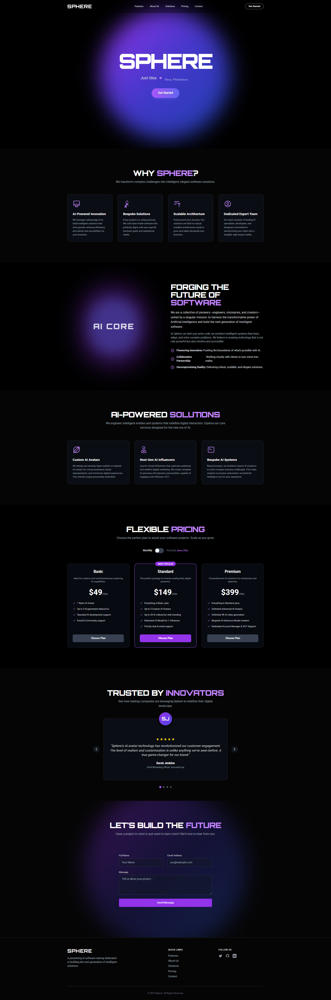

# SPHERE -- Landing Page

Una landing page moderna y futurista creada con **React + TypeScript**,
diseñada inicialmente con el generador de apps de **Google AI Studio** y
posteriormente refinada a mano.\
Posee animaciones fluidas, una arquitectura clara y un diseño
completamente responsivo, lista para desplegar en cualquier plataforma
moderna.


---

## 🚀 Tecnologías Utilizadas

- **React + TypeScript**
- **Framer-Motion** para animaciones
- **Google AI Studio App Generator** como base inicial
- **CSS responsivo** optimizado para mobile y desktop

---

## ✨ Características

- Diseño futurista con estética AI/Tech.
- Animaciones suaves utilizando framer-motion.
- Componentes limpios y reutilizables.
- Responsive design desde 320px hasta pantallas 4K.
- Secciones incluidas:
  - Hero destacado
  - Por qué elegir Sphere
  - AI Core
  - AI-Powered Solutions
  - Planes de precios
  - Testimonios
  - Formulario de contacto

---

## 📁 Estructura del Proyecto

    src/
     ├─ components/
     ├─ sections/
     ├─ assets/
     ├─ hooks/
     ├─ styles/
     └─ main.tsx

La estructura puede variar ligeramente según cómo Google AI Studio
generó la base del proyecto, pero se mantiene fiel al estándar de
React + TS.

---

## 🛠 Instalación

1.  Clonar el repositorio:

    ```bash
    git clone https://github.com/tuusuario/sphere-landing.git
    ```

2.  Instalar dependencias:

    ```bash
    npm install
    ```

3.  Ejecutar en modo desarrollo:

    ```bash
    npm run dev
    ```

---

## 🚢 Despliegue

Este proyecto está listo para usarse en:

- **Vercel**
- **Netlify**
- **Firebase Hosting**
- **Cloudflare Pages**
- o cualquier hosting estático compatible con React/Vite.

Build de producción:

```bash
npm run build
```

Luego subir la carpeta `dist/`.

---

## 📬 Contacto

Si deseas mejorar esta landing o crear una versión personalizada para tu
empresa, puedes contactarme.

---

## 📄 Licencia

Proyecto libre para uso personal y comercial. Créditos opcionales son
bienvenidos.
